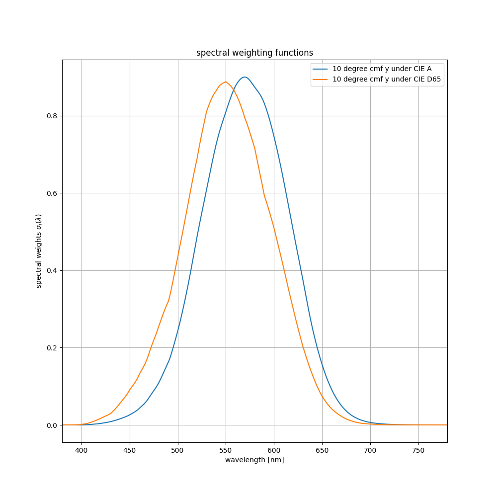

# Introduction
This repository contains Python code on the topic of metamer mismatching, in particular a re-implementation of the algorithm described in [1].

At the beginning of my research, almost all legacy code was only available in Matlab.
My original motivation was to create a unified Python framework.
Due to the lack of time, the project was abandoned after I left research.
Due to various requests for the implementation of [1] and talks with fellow researchers, I decided to refactor and finally publish relevant parts of the codebase.
A visual tutorial on the concept of metamer mismatching is also included.

If you find it useful or use it in your own research, kindly cite the associated publications [1, 2].

## About Me
My name is Tarek Luttermann (formerly Tarek Stiebel).
I received my Dr.-Ing (Ph.D) in electrical engineering from RWTH Aachen University in 2021.
During my time as a research scientist at the Institute of Imaging and Computer Vision, i was responsible for the field of multi-spectral imaging.
This mainly covered various applications and projects in industry.
However, I also found interest in color science and, in particular, metamerism.

Feel free to connect with me on LinkedIn if you want to discuss these topics.

## Getting Started
The class solver.OptimizeTangent allows you to calculate metamer mismatch bodies on your own.
Essential inputs are the color mechanisms associated with two viewing conditions as well as the color signal observed under the first condition.
Examples on how to use and configure the solver are given in the following scripts:
* example_simple.py: 1d to 1d example that is also shown inside the tutorial section below
* example_3D.py: 3D to 3D example of illuminant induced metamer mismatch (human standard observer from CIE A to CIE D65).

#  Background
Two objects are said to be *metameric*, if they lead to identical color signals although having different object reflectances.
The "metamer set" is the set of all theoretically possible object reflectances that lead to a given color signal.
The "metamer mismatch volume" describes the metamer set observed under different viewing conditions, for example under a different illumination or by a different observer.
The change in viewing condition will most likely cause the original metamer set to project to an entire volume of color signals, the metamer mismatch volume or metamer mismatch body.
Assuming that spectral object reflectances must be within the range [0, 1], Logvinenko [3] proposed a set a functions that describe the theoretical bounds of metamer mismatch bodies in terms of optimal reflectance functions.

*Optimal colors* that are associated with *optimal reflectance functions* were first postulated by Willhelm Ostwald at the beginning of the 20th century.
Erwin Schrödinger proved in 1919 that optimal colors in fact bound the set of all colors theoretically observable to the human observer.
The concept of optimal colors has been fundamental for various researchers throughout the 20th century.
Optimal colors and associated optimal reflectance functions are likewise fundamental to the theory on metamer mismatching by Logvinenko.

## Related Work
The theory developed by Logivenko [3] can be interpreted in different ways.
Multiple publications have since been published.
Next to the more theoretical approach by Logvinenko, there have also been approaches motivated by real-world observations.
For example, the data driven approach by Finlayson [7] most certainly deserves special mention.
Here is a short list of publications, mostly related to the theory by Logvinenko, that you might find interesting in context of this repository.
* [1] A Robust Algorithm for Computing Boundary Points of the Metamer Mismatch Body, *Tarek Stiebel and Dorit Merhof*, In: Twenty-sixth Color and Imaging Conference (CIC), 2018
* [2] The Importance of Smoothness Constraints on Spectral Object Reflectances when Modeling Metamer Mismatching, *Tarek Stiebel and Dorit Merhof*, In: IEEE International Conference on Computer Vision Workshop (ICCVW), 2017
* [3] Metamer Mismatching, *Alexander D. Logvinenko and Brian V. Funt and Christoph Godau*, IEEE Transactions on Image Processing, 23, 34-43, 2014
* [4] A Simple Algorithm for Metamer Mismatch Bodies, *Paul Centore*, 2017
* [5] Spherical sampling methods for the calculation of metamer mismatch volumes, *Michal Mackiewicz, Hans Jakob Rivertz, Graham D. Finlayson*,  J. Opt. Soc. Am. A 36, 96-104, 2019
* [6] Metamer mismatching in practice versus theory, *Xiandou Zhang, Brian Funt, and Hamidreza Mirzaei*, J. Opt. Soc. Am. A 33, A238-A247, 2016
* [7] Metamer Sets, *Graham D. Finlayson and Peter Morovic*, J. Opt. Soc. Am. A 22, 810-819 (2005)
* [8] Metamer Mismatching and Its Consequences for Predicting How Colours are Affected by the Illuminant, *X. Zhang, B. Funt and H. Mirzae*, IEEE International Conference on Computer Vision Workshop (ICCVW), 2015

I do by no means claim above list to be a complete representation of the field.
If there is other work you would like to see incorporated, kindly contact me.

Logvinenko developed the original theory in [3].
However, it can be surprisingly challenging to actually find solutions to the proposed equations.
Two algorithms where proposed in the original work [3] to actually estimate or approximate boundary points of the metamer mismatch body.
They work, but there are limitations:

* Since it is solved directly for boundary points of the MMB, it is crucial that these boundary points actually exist. There are various scenarios where the boundary of the MMB might become metameric itself (e.g. in the case of partially-zero illuminants). In such a case, the notion of boundary points as considered by Logvinenko does no longer exist.
* The boundary surface is not sampled in a consistent and reproducible way.
* The (n-1)-approximation underestimates the MMB if the spectral curve is not convex.

An alternative approach to describing an MMB in terms of boundary points is to describe the boundary of the metamer mismatch body in terms of inequality constraints / half-space intersections / tangent hyperplanes / dual space representation.
The same underlying concept has been given many names by different researchers [1,4,5].

# Visualizing Underlying Geometric Concepts
Here is a visual summary on the theory of metamer mismatching by Logvinenko as well as the geometric interpretation.

Let us consider the following scenario:
There is one human observer located indoors (1964 standard observer under CIE A) and one human observer located outdoors (1964 standard observer under CIE D65).
It is a showcase for illuminant induced metamer mismatching.
The color matching functions of the human observer as well as the spectral power distributions of the illuminants are shown below.

    

The spectral power distribution of the light can be combined with the color matching functions to form spectral weights.
The spectral weights associated with both viewing conditions are plotted below.

    

Spectral weights allow us to compute color signals when viewing an object. 
$\begin{pmatrix}X\\Y\\Z\end{pmatrix} = \int \sigma(\lambda) r(\lambda) d\lambda$
The object is hereby given by its spectral object reflectance, $r(\lambda)$. 

## Object Color Solid
Let us assume the first observer views the object $r(\lambda) = 0.5$.
He would therefore observe the color signal (55.57, 50, 17.6)^T.
What is the set of color signals that the second observer could possibly observe?

At the moment, we are considering two three-dimensional spaces, i.e. tristimuli to tristimuli. 
To better visualize the underlying concepts, let us only consider the brightness (Y-channel).
We now have two one-dimensional spaces and the first observer observers the signal 50.
What is the set of values that the second observer could observe?

In order to answer this question, Logvinenko proposed [3] to "stack" or unify both observers.
In our example, we would now have one unified 2D observer, instead of two individual 1D observers.
This unified observer is again characterized by its spectral weights.

    

The next question we need to ask is what is the set of all color signals that the unified observer could possibly observer?
This set is referred to as the *object color solid* (OCS).

    

Inside this plot of the OCS, we can also draw the color signal that our first observer observed as a line.

    

The metamer mismatch body is directly visible as the intersection of the OCS, drawn in blue, with our observation, drawn as black line.

## Calculating the Boundary of the Metamer Mismatch Body
The question remains how we can calculate the boundary of the MMB.
We therefore consider the spectral weights of our unified observer. 
The spectral weights can also be considered as a curve in space, as plotted on the right side.

    

The 2D space the spectral curve resides in can be split in half by any line through the origin.
This line is uniquely defined by its normal vector.
The intersections of the line with the spectral curve define the transition wavelength of a complementary pair of optimal reflectance functions.
Respectively integrating the spectral curve on each of the half-spaces leads to two boundary points of the OCS (if they exist).
The boundary points are furthermore characterized by the fact they are the intersection of a line tangent to the OCS having the same normal as we initially chose.

    

In summary, a normal can be mapped to
* two complementary boundary points of the OCS (if they exist)
* two complementary hyperplanes tangent to the OCS
* two complementary optimal reflectance functions (if they exist)

### Algorithm for calculating the MMB
Above concepts lay the foundation for various approaches to calculate an MMB.

Start by estimating a point that is located inside the MMB. 
This is a rather simple problem and we just assume its solution as granted. 
It is then possible to sample the MMB boundary in arbitrary directions from the point inside the MMB.
In terms of our 2D example of metamer mismatching, it means that we want to find the intersections of the black line with the boundary of the OCS.
As previously touched on, it is possible to parametrize our boundary in terms of normal vectors.
Any normal will map to a hyperplane tangent to the OCS.
The hyperplane can then be intersected with our "search line".
In order to find the boundary point it is necessary to minimize the distance from the point of intersection to the central point inside the MMB.

    

## 3D MMB
The described concept can be abstracted to higher dimensional camera systems or observers.
Coming back to our original 3D example of illuminant induced metamer mismatching for a human observer, this is how the metamer mismatch body would look like.

    

